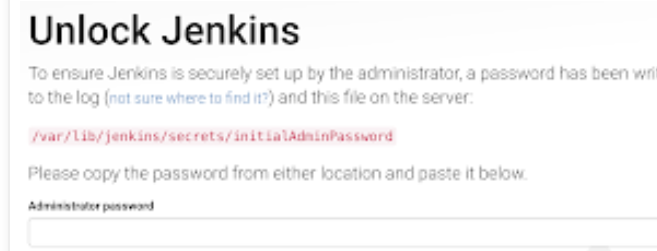

## CI/CD

CI - Continuous Integration
CD - Continuous delivery
CDe - Cintinuous deployment

 CI/CD is a software development practice that involves automating and streamlining the process of building, testing, and deploying applications. It enables development teams to integrate code changes regularly and automatically run tests to identify issues early on.

 

 1.Code is developed locally. Once it's developed, we set up ssh locally and push the code/ what we have developed to e.g. a repo on github. We then need something to test the code using an automation server. But before this, we need something to notify us when a change has been made and pushed. This is known as a webhook.

 A webhook is a mechanism that allows real-time communication between two systems, enabling one system to send automated notifications or data to another system based on certain events or triggers

 2. All the data is merged into one, and then we want the changes to be notified to a software that automatically tests the changes, e.g., Jenkins. Jenkins will therefore need to send a request to github to get a copy and test it. This means that ssh also needs to be set up between jenkins and git hub

 3. Once the automates tests have been run and they are successful, meaning that we have a runnable instance of our code, it is ready to be deployed. 


 ## Jenkins 

Jenkins is an open-source automation server that helps in building, deploying, and automating software development processes. It provides a platform for Continuous Integration (CI) and Continuous Delivery/ Deployment (CD) by allowing developers to automate various stages of the software development lifecycle. With Jenkins, developers can define and configure pipelines, perform automated builds and tests, and facilitate the deployment of applications to different environments.


1. When we have developed code, we then push it to github using ssh
2. Jenkins is notified by a webhook trigger, and jenkins then proceeds to copying the code from github
3. First, jenkins uses Agent Node to test the code. If it finds that there are no problems with the code, it is then passed to the Master Node. Alternatively, if there are errors, the code is returned with feedback and the required changes should be made. 
4. If there are no problems with the code, the Master Node then continues on to push the code to AWS using SSH. For continuous delivery, it can just push the code, but leave us to do the deployment mannually (e.g. to start an app, we would use 'node.js'). The other option is continuous deployment, where both the code is pushed automatically and deployment is also autiomated. 


## Other tools

GitLab CI/CD: GitLab provides a complete DevOps platform that includes built-in CI/CD capabilities. It offers a seamless integration with GitLab's version control system, providing a unified experience for development, testing, and deployment.

Travis CI: Travis CI is a cloud-based CI/CD platform that integrates well with GitHub. It simplifies the process of building, testing, and deploying applications by automatically detecting changes in the repository and triggering the necessary workflows.

CircleCI: CircleCI is another cloud-based CI/CD platform that supports building, testing, and deploying applications. It offers ease of use and integrates with popular version control systems like GitHub and Bitbucket.

Bamboo: Bamboo is an Atlassian product that provides CI/CD capabilities. It allows teams to automate their builds, tests, and deployments with a focus on seamless integration with other Atlassian tools such as Jira and Bitbucket.

Azure DevOps: Azure DevOps, formerly known as Visual Studio Team Services (VSTS), is a comprehensive platform by Microsoft that includes source control, project management, and CI/CD capabilities. It provides a range of tools and services for building, testing, and deploying applications on Microsoft Azure.

TeamCity: TeamCity is a CI/CD server by JetBrains that offers robust features for building, testing, and deploying applications. It supports various programming languages and provides extensive customization options.


## Connecting projects and automating agent to master node

1. On Github, go to the repo (with the app folder for this demo) and nagivate to settings > deploy keys. Then click on 'add deploy key'


2. Add in the you key's name and paste in the key output (remeber to do this for yout public key only)


3. Go back to jenkins and create a new freestyle project (remember to give it a name) 


4. You can select the max number of build that you would like to keep at a time


5. Next, select 'GitHub project' and copy your repo's HTTP url (from GitHub) and paste it into the project URL section


6. Choose 'Git' as the 'Source Code Management' and copy the SSH link of your GitHub repository and paste it into 'Repository URL'. You can then add a new SSH key by clicking the 'add' button

We can then select 'SSH Username with private key' and enter an ID for the key and the Private key itself by pasting in our private key, clicking 'Add' when finished.


8.

9.


##  Setting up Webhook with GitHub and Jenkins

1. Go to your GitHub repository and click on ‘Settings’.

2. Click on Webhooks and then click on ‘Add webhook’.


3. In the ‘Payload URL’ field, paste your Jenkins environment URL. At the end of this URL add /github-webhook/. In the ‘Content type’ select: ‘application/json’ and leave the ‘Secret’ field empty.

4. In the page ‘Which events would you like to trigger this webhook?’ choose 'just push the event' and click on ‘add webhook’.

5. In Jenkins, create a new job. Following our previous steps

In configuration settings, got o Office 365 Connectors, and tick 'restrict where this project can be run' and enter the name of the Master Node


7. Click on the ‘Build Triggers’ tab and then on the ‘GitHub hook trigger for GITScm polling’. This is to let Jenkins listen to GitHub for any changes/ pushes made 


8. Click on the ‘Build’ tab, then click on ‘Add build step’ and choose ‘Execute shell’.

9. In the build section, enter our commands to perform the tests. These will be triggered everytime the GitHub repo is updated. 


## Pipeline


## Continuous delivery 


## Step 1 

To Automate the merging process from development to main branch: 

1. Create a dev branch and checkout using:

```
git checkout -b dev
```

Create a new job e.g., alema-ci

### General section
3. Like before, discard old builds (e.g., set max build to keep 3)

4. For GitHub project, add your repo's http url 

### Source Code Management
1. select git
2. Add your repo's SSH url
3. In credentials, add your key
4. In branches to build, specify '*/dev'


### Build Triggers
1. select GitHub hook trigger for Gitscm polling 


### Build environment
1. Select 'provide Node & npm bin/folder to path'
2. Select SSH Agent
3. Also select specific credentials and add the 'tech230.pem' key


## Step 2 

Create job 2 - to merge the development changes to the main branch.

1. Create a second job called alema-ci-merge

2. Go through previous steps e.g., discard old builds, github project > add github repo http url, office 365 connector > restrict where project can be run to sparta-ubuntu-node


3. Source code management > git > ssh url & credidentials > branch specifier > */dev 

4. additional behaviours > origin, main, default, --ff

5. build triggers > build after other project are built > trigger only if build is stable 


6. skip build env

7.  Build > in execute shell enter 'git checkout main' and 'git merge origin/dev' 

```
git checkout main
git merge origin/dev
```


## Step 3 

Create job 3 

1. Same office 365 connector section as above

2. Source code management > select git > add repo http url > add key

3. Build triggers > select build after other projects are built. In projects to watch, add your second job e.g. 'alema_ci_merge'. Then make sure to select 'trigger only if build is stable' 

4. In build environment, select 'SSH Agent'. In credentials > specify credentials > add the key 'tech230.pem'

5. Add in your commands as shown below:

```
ssh -o "StrictHostKeyChecking=no" ubuntu@52.17.211.146 <<EOF
sudo rsync -rv --exclude=".git" /home/ubuntu/app/
cd /home/ubuntu/app
pm2 kill
pm2 start app.js
EOF
```

In the commands, followin 'ubuntu@' enter your EC2 instances public IP address.


6. To check that everything is working, you should be able to coppy and paste the instances public IP adress (using http) into a web browser and see the sparta app page:


### Creating a jenkins server using AWS

1. Create a ubuntu 18.04 instance on aws 

2. SSh into instance

3. Sudo apt update && upgrade

4. Install Java using:

```
sudo apt install default-jre -y

sudo apt update && Upgrade
```

Jenkins Setup

5. Add Repository key to the system
curl -fsSL https://pkg.jenkins.io/debian/jenkins.io-2023.key | sudo tee \
  /usr/share/keyrings/jenkins-keyring.asc > /dev/null

6. Append debian package repo address to the system
echo deb [signed-by=/usr/share/keyrings/jenkins-keyring.asc] \
  https://pkg.jenkins.io/debian binary/ | sudo tee \
  /etc/apt/sources.list.d/jenkins.list > /dev/null


7. sudo apt update

8. Install Jenkins

```
sudo apt install jenkins -y
```

9.  Start Jenkins using the commands:

```
sudo systemctl start jenkins
sudo systemctl enable jenkins
sudo systemctl status jenkins
```

10. Access Jenkins in web browser by copying you ec2 instances public ip adress into a web browser. Follow this with ':8080' (after the ip adress in the web browser)

11. You should see a page like the one below:



12. The next step is to generate the password using the command:

```
sudo cat /var/lib/jenkins/secrets/initialAdminPassword
```


13. Add the password to the jenkins web page 

14. In the next page that comes up, select 'install suggested plugins'. We will add in more plugins later on

15. Then create user name and password.
Enter t user name as admin password as admin


After this step, you can officially use jenkins!

16. To do the jobs we have done before, we will first need to add some more plug ins. Go to manage jenkins > plugins > and then add in all the relevant plug ins e.g.: Amazon EC2, NodeJS, Git Server, Git Push, SSH Agent, Office 365 Connector...

17. You also want to configure nodejs. Go to manage jenkins > tools and do the following:

in 'NodeJS installation'


18. Then proceed to making your 3 jobs. Remember to change the webhook to have your Jenkins IP adress.

- We also no longer need to use the 'sparta-ubuntu-node' (as tests will now run on your own master node)

- To allow for connection to github using ssh, we also need to go to manage jenkins > security > and scroll down to 'Git Host Key Verification Configuration' set it so that it will 'accept first connection':


- Remeber to creat an app-jenkins instance on aws before the 3rd job! Add to SG to allow your jenkins IP on port 22, enable public IP with port 8080...

- Remember to add ssh keys for alema-jenkins and tech230.pem